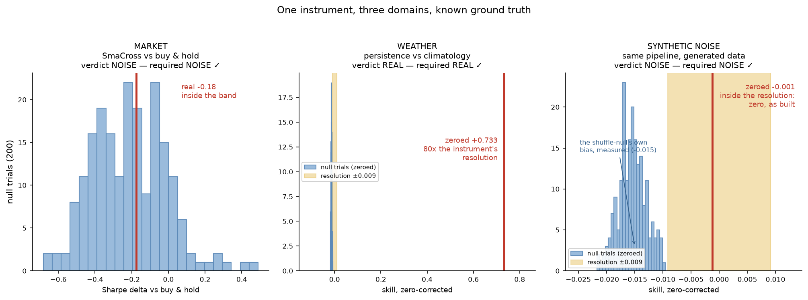
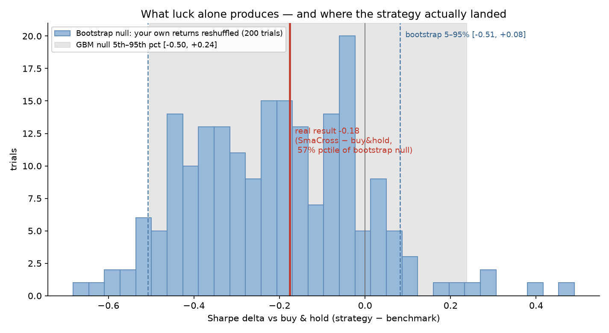

# algotrader

A paper-trading-first algorithmic trading framework for US equities. Backtest engine with an honest cost model, pluggable strategies, walk-forward validation, and an Alpaca paper-trading loop.

**Runs entirely on free APIs. No money is required, and the code physically refuses to trade a live account.**

## The instrument

This project began as a trading bot and became something more useful: a
**domain-agnostic instrument that tells real results apart from noise** — and
that has been made to prove it in both directions, on data where the truth is
already known.



| Domain | Ground truth | Instrument's verdict | The number |
|---|---|---|---|
| Markets — SmaCross vs buy-and-hold | efficient; no simple edge exists | **NOISE** ✓ | Sharpe delta -0.18, 57th percentile of its null |
| Weather — persistence vs climatology | real physics; today predicts tomorrow | **REAL** ✓ | skill +0.344 raw, +0.733 zeroed — 80× the instrument's resolution |
| Synthetic noise — same pipeline, generated data | structureless by construction | **NOISE** ✓ | zeroed skill -0.001, inside the ±0.009 resolution |

A detector that always answers "noise" is `return False` with extra steps;
one that always finds signal is a salesman. Reading correctly in both
directions, through one code path (`src/validation/harness.py`), is the
claim. Every number above traces to a committed artifact
(`reports/universality.json`), and a test pins this table to it.

Two design principles carry all of it:

**A null declares exactly which structure you accuse the result of
exploiting, then destroys only that.** Markets get a ~20-day block bootstrap
(kills multi-week trends, keeps fat tails and volatility clustering). Weather
gets an anomaly shuffle (kills day-to-day persistence, keeps seasonality).
Swapping them would silently invalidate both experiments — a test proves the
weather signal survives block-shuffling, which is precisely why blocks must
never be its null.

**The instrument is zeroed like any bench instrument.** Running the pipeline
on structureless data doesn't score exactly zero — the shuffle null carries a
small measured bias (+0.016) — so the zero point is measured against 30
seeded blanks and subtracted, and the zero distribution's spread (±0.009) is
the instrument's resolution. A verdict of REAL requires clearing the null
band AND exceeding that resolution after zeroing. The synthetic-noise column
above is the zero test passing. (`reports/calibration.json` holds the zero;
the analytic cross-check — no-skill persistence on Gaussian anomalies is
1-√2 ≈ -0.414 before finite-sample effects — is logged with it.)

Weather data by [Open-Meteo](https://open-meteo.com/) (CC BY 4.0),
10 cities, 1980→present, fetched politely and cached.

---

## Domain #1: the market (where this project started)




*The project's thesis in one image: 200 resamples of the real universe's own
returns (histogram) define what luck produces; the strategy's real result
(red) lands in the middle of it. A tool that says "no edge demonstrated" when
there is none is the deliverable.*

```
┌─────────┐   ┌──────────┐   ┌───────────┐   ┌────────┐   ┌────────┐
│  Data   │──▶│ Strategy │──▶│  Backtest │──▶│  Risk  │──▶│ Broker │
│ Alpaca/ │   │ → target │   │  next-open│   │ limits │   │ paper  │
│ Stooq/  │   │  weights │   │  fills +  │   │ + kill │   │ or dry │
│ cache/  │   │          │   │  costs    │   │ switch │   │  run   │
│ synth   │   │          │   │           │   │        │   │        │
└─────────┘   └──────────┘   └───────────┘   └────────┘   └────────┘
```

---

## Quick start (60 seconds, no signup)

```bash
git clone <your-repo> && cd algotrader
pip install -r requirements.txt
python scripts/run_backtest.py --synthetic --benchmark
```

That runs the whole pipeline on generated data. No API keys, no account, no network.

Now run it on **real market data**. That needs free Alpaca keys — no card, about two minutes:

1. Sign up at [alpaca.markets](https://alpaca.markets) → switch to **Paper Trading** → **API Keys**
2. `cp .env.example .env` and paste your keys in
3. `python scripts/run_backtest.py --benchmark`

Bars are cached to disk, so a repeat run the same day needs no network at all.
(When `end:` is null — "up to today" — the cache is keyed to the calendar day,
so the first run of a new day refetches. One request per symbol per day is the
price of the window actually being what it claims; pin an explicit `end:` in
`config.yaml` if you want a frozen, never-refetched window.)

Bars arrive **split- and dividend-adjusted** (`data.adjustment: "all"` in
`config.yaml`, passed explicitly to Alpaca). Buy-and-hold is a total-return
benchmark, so comparing a strategy against it on unadjusted bars flatters the
strategy. Set `adjustment: "raw"` only to see the failure mode for yourself —
the quality audit below will light up on every split in the window.

Every real-data run starts with a quality audit, because a generator cannot produce a bad bar and real feeds routinely do:

```
  NVDA: 1200 bars, 2020-01-02 -> 2024-08-07
    !! [suspected_split] 2022-09-08: overnight 97.50 -> open 9.76 (ratio 9.990 ~ 10:1,
       volume x10.2 corroborates). If this is an unadjusted split the backtest
       will trade a crash that never happened.
```

An unadjusted 10:1 split is a -90% single-bar "crash". A mean-reversion strategy buys it and prints a beautiful equity curve. Nothing else in the codebase would flag it. The detector reads the **overnight** ratio (a split lands at the open, before the day's trading) and requires **volume corroboration** (a split re-denominates the share count; a crash does not) — so a genuine -34% crash or a +50% takeover pop gets a `large_gap` warning, not a false accusation of data corruption.

<details>
<summary>There is also a keyless source — read this before using it</summary>

`--source stooq` pulls free daily CSVs from stooq.com with no account at all. It is **not** the default, on purpose: stooq.com's `robots.txt` disallows all user-agents except Googlebot and Bingbot (verified). That is the reason this source must never be automated — no cron jobs, no CI, no looping over symbols with the cache off.

Fetching a handful of daily bars for personal research is a gray area that plenty of tooling lives in — pandas-datareader ships a Stooq reader — but shipping it as the default of a public repo points everyone who clones it at an endpoint that asked not to be crawled. Alpaca is an official API with terms that permit programmatic use, so that is what this repo defaults to.

If you decide Stooq is appropriate for your use, keep the cache enabled so a repeat run costs zero requests.

</details>

---

## What's free here

| Thing | Provider | Cost | Catch |
|---|---|---|---|
| Historical bars (incl. intraday) | Alpaca Market Data | $0 | Free keys, ~2 min. IEX feed only (~2% of true volume), 15-min delay on recent data |
| Historical daily bars | Stooq | $0 | Opt-in, no signup. Daily only; split- but not dividend-adjusted; **robots.txt permits only Googlebot/Bingbot — never automate this source** |
| Paper trading account | Alpaca | $0 | Simulated fills — optimistic vs. reality |
| Order execution API | Alpaca | $0 | 200 req/min rate limit |
| Hosting | Your laptop, or any free-tier VM | $0 | Needs to stay running during market hours |

The IEX-only limitation is real but not fatal for daily bars. It matters a lot for anything intraday.

---

## Commands

```bash
# Backtest with the config.yaml strategy
python scripts/run_backtest.py

# Compare against buy-and-hold (the only comparison that matters)
python scripts/run_backtest.py --benchmark

# Is this parameter choice robust, or did I get lucky once?
python scripts/run_backtest.py --sensitivity

# Does it survive on data it never saw?
python scripts/run_backtest.py --walk-forward

# Is my result even distinguishable from luck?
python scripts/run_backtest.py --synthetic --noise-test

# Try a different strategy without editing config
python scripts/run_backtest.py --strategy mean_reversion --benchmark

# Paper trading — logs intended orders, submits nothing
python -m src.live --once

# Paper trading — actually submits to the PAPER account
python -m src.live --live-orders

# Tests
python -m pytest tests/ -v
```

---

## The three things this project does that most tutorial bots don't

### 1. Fills happen on the next bar's open

A signal computed from today's close cannot be executed at today's close — you only knew the close after the bar ended. Filling on the same bar is the single most common source of fake backtest profits, and it can turn a losing strategy into a spectacular winner on paper.

There's a test for this (`test_no_lookahead_bias`) that constructs a price series with a 100% overnight gap and asserts the engine *fails* to capture it. If you refactor the engine and that test starts passing suspiciously well, you broke something.

### 2. Costs are modelled pessimistically

Default is 5 basis points of slippage per side. Alpaca charges no commission on stocks, so slippage is the whole cost — and it's the thing that quietly kills high-turnover strategies.

Try this to see it: run the same strategy at `slippage_bps: 0` and `slippage_bps: 20` in `config.yaml`. A strategy trading 200 times a year loses roughly 8% annually to the difference.

The shipped values (5 bps, zero commissions) are **pinned by a test** (`test_shipped_cost_model_is_pinned`) — an audit measured that a +40% slippage change moved the published numbers by *less* than cross-platform float noise, so the docs-drift check alone cannot catch a quiet cost cut. Changing the cost model on purpose means updating that test, this section, and re-running `scripts/refresh_docs.py` in the same commit.

### 3. Validation tools that try to prove you wrong

Running one backtest and liking the number is not research. Two tools push back:

**`--sensitivity`** scores a whole grid of parameters. Read the *shape*, not the peak. A real edge shows a broad plateau of decent results across neighbouring parameters. One spiking cell surrounded by losses is noise you happened to fit.

**`--walk-forward`** optimises parameters on a training window, then scores those parameters on the *next*, unseen window. Here's actual output from the SMA crossover on random-walk data — data that has zero exploitable structure by construction:

<!-- generated:walk_forward -->
```
 fold                    params  in_sample_sharpe  oos_sharpe  oos_benchmark_sharpe  oos_edge  oos_return  oos_maxdd  oos_trades
    1 {'fast': 50, 'slow': 100}            -0.397       0.165                -0.029     0.194      0.0116    -0.0979          53
    2 {'fast': 50, 'slow': 100}            -0.123      -0.512                -0.382    -0.130     -0.0546    -0.1220          43
    3 {'fast': 50, 'slow': 100}            -0.086      -1.648                -1.077    -0.571     -0.0911    -0.0929          31
    4 {'fast': 50, 'slow': 100}            -0.455      -0.409                 1.227    -1.636     -0.0655    -0.1790          56

  Mean in-sample Sharpe:      -0.27
  Mean out-of-sample Sharpe:  -0.60
  Mean OOS benchmark Sharpe:  -0.07
  Mean OOS edge:             -0.54   (1/4 folds positive)

  Read the EDGE column, not the raw OOS Sharpe — an unbenchmarked
  Sharpe just tells you what the market did in that window.
  Note: in-sample is the BEST of 15 parameter sets while
  out-of-sample is a single run, so the gap overstates degradation.
  Note: only 4 folds — the standard error here is large.
  Treat the mean edge as indicative, not conclusive.
```
<!-- /generated:walk_forward -->

Two lessons in one table. In-sample Sharpe collapsing out-of-sample is overfitting — there is nothing to find in this data, yet parameter search "found" something anyway.

The second lesson is subtler and cost me a bug: **read the edge column, not the raw OOS Sharpe.** An earlier version of this table omitted the benchmark entirely, so a fold with a positive `oos_sharpe` looked like a pass — while buy-and-hold scored higher on the identical window. An unbenchmarked Sharpe just tells you what the market did.

**`--noise-test`** runs the strategy against many random-walk universes to build a null distribution — the range of results luck alone produces:

<!-- generated:noise_test -->
```
  Sharpe delta vs buy & hold (strategy minus benchmark):
    mean              -0.163
    std deviation      0.206
    5th–95th pct      -0.503 to +0.123
    full range        -0.517 to +0.204
    strategy 'won'    22% of trials
```
<!-- /generated:noise_test -->

On data with zero exploitable structure, this strategy still beat buy-and-hold in roughly a third of universes, sometimes by a wide margin. So a single backtest showing a modest Sharpe edge is not evidence of anything until you have checked it against that band.

Those universes are a **correlated** basket (one-factor model, pairwise correlation ~0.8), not independent random walks. This matters: real large caps move together, and independent paths diversify away nearly all portfolio variance, producing a null band that is too narrow. An earlier version made that mistake and reported a band of [-0.55, +0.17] — artificially tight, which biases toward falsely declaring a result "outside the noise."

The headline synthetic run uses the **same** correlated generator, on an independent seed. That is not a detail: for a while it did not, and the headline was therefore not a draw from the band it was being compared against. A comparison between two different processes is not a comparison.

**Where the shipped strategy actually lands:** inside the band, close to the null mean. That is the correct result. The data is a random walk — a tool that reported an edge here would be broken. The point of this repo is a harness that can tell you that clearly, not a strategy that beats it.

This is the tool to reach for when a result excites you. Run it before you believe a number.

### Two nulls: random walks, and your own returns reshuffled

The band above is built from **synthetic correlated random walks** (GBM). That
null is free and needs no data, but it is too polite: real returns have fat
tails (days a Gaussian thinks are impossible) and volatility clustering
(crashes travel in packs), and both let luck produce wilder outcomes than a
random walk can. A band built from GBM is therefore somewhat too narrow on
real data — biased toward telling you a fake edge is real.

`--null bootstrap` rebuilds the band from the loaded universe's **own returns,
resampled** with a stationary block bootstrap (Politis–Romano): blocks of
~20 trading days, drawn with the SAME block sequence for every symbol so the
universe still moves together, and (overnight, intraday) return pairs kept
intact so real gaps survive for the next-open fill discipline to bite on.
Fat tails and clustering survive; any exploitable long-range sequence does
not.

In dyno terms: the GBM null asks "how much does a *generic* engine's number
vary run to run?" The bootstrap null asks the sharper question — "how much
does *my* engine's number vary run to run, with its actual compression and
its actual misfires, when nothing about it has changed?" Same verdict logic,
honester baseline.

```bash
python scripts/run_backtest.py --noise-test --null bootstrap --trials 200
```

---

## Results on real data

First executed 2026-08-17 (Alpaca IEX daily bars, split- and dividend-adjusted,
5 symbols: SPY QQQ AAPL MSFT NVDA). Numbers below reproduce from the cache on a
rerun; they will drift slightly as new bars arrive.

**Data quality.** The audit found 0 errors and 7 warnings. The warnings are
informative, not fatal: the free IEX feed only serves history back to ~2020-07
(SPY carries a stray 2018 segment followed by a 634-day hole, which the audit
flagged and the engine's intersection logic discarded), and NVDA's +24.3%
session on 2023-05-25 — the post-earnings gap — is correctly reported as a
`large_gap` warning rather than a split, because volume did not corroborate a
re-denomination. The effective backtest window is 2020-07-27 → 2026-08-17.

**Adjustment matters, measured.** Fetching the same universe `raw` instead of
`all`: the audit fires `error:suspected_split` on exactly NVDA 2021-07-20
(ratio 4.012, volume ×2.2), NVDA 2024-06-10 (10.042, ×6.0) and AAPL 2020-08-31
(3.912, ×6.0) — and is silent on those dates when adjusted. On raw bars the
strategy's Sharpe drops 1.05 → 0.46 and the Sharpe-vs-benchmark delta doubles
from -0.12 to -0.24. That distortion is why `adjustment: "all"` is the default
and why raw results are never quotable.

**The headline.** SmaCross(20/100) vs buy-and-hold, after costs:

| | SmaCross | Buy & hold |
|---|---|---|
| Sharpe | 1.05 | 1.17 |
| CAGR | 17.1% | 28.6% |
| Max drawdown | -28.9% | -34.6% |
| Total costs | 145.35 | 15.37 |

**The strategy loses to buy-and-hold by 0.12 Sharpe.** Walk-forward is harsher:
mean out-of-sample edge **-1.45**, 0 of 4 folds positive — in-sample parameter
selection (mean IS Sharpe 1.32) collapses to -0.11 OOS while the benchmark
scored 1.34 on the same windows. This is the expected result for a
one-sentence strategy on large caps, published as-is.

**Both nulls, properly powered (200 trials each, 15-symbol universe).**
Same strategy, same real data, two different definitions of "luck":

| Null (200 trials) | 5th–95th band | mean | win rate | real result lands at |
|---|---|---|---|---|
| GBM (synthetic random walks) | [-0.50, +0.24] | -0.14 | 24% | 45% percentile |
| Bootstrap (own returns reshuffled) | [-0.51, +0.08] | -0.21 | 13% | 57% percentile |

The real 15-symbol result (-0.18 Sharpe vs buy-and-hold) lands
**inside both bands**. The bootstrap band is narrower
(0.59 vs 0.74 Sharpe across the 5th–95th range) —
on this universe the resampled returns produced a tighter spread than the GBM null; see NIGHT_LOG for the reading.
Verdict either way: **no demonstrated edge** — the correct, expected result.

**The full gauntlet, both strategies (15 symbols, 2020-07 → 2026-08).** Read
the edge column only; the config-default row is reported regardless of what
the grid's best cell says:

| | sensitivity: cells beating buy-and-hold | config-default edge | walk-forward mean OOS edge | folds positive |
|---|---|---|---|---|
| `sma_cross` (20/100) | 1 of 15 | -0.18 | -0.76 | 0 of 4 |
| `mean_reversion` (20/1.0) | 1 of 16 | -0.42 | -0.49 | 0 of 4 |

Each grid's single positive cell (+0.07 and +0.08 respectively) is exactly the
"one spiking cell surrounded by losses" shape the sensitivity section warns
about — and both values sit deep inside both null bands above. Neither
strategy demonstrates an edge on real data. Published as measured.
Spot-check: our closes match Google Finance to within cents (SPY 772.62 vs
772.67 — IEX vs consolidated tape).


---

## Configuration

Everything lives in `config.yaml`. The knobs worth understanding:

```yaml
backtest:
  slippage_bps: 5.0          # per side. Raise it until the strategy dies,
                             # then ask how confident you are in the real number.
risk:
  max_position_pct: 0.25     # per-name cap
  max_gross_exposure: 1.0    # 1.0 = no leverage
  max_daily_loss_pct: 0.03   # live kill switch — flattens and stops
live:
  dry_run: true              # log orders, don't send them
```

---

## Adding a strategy

Three steps:

```python
# src/strategies/my_strategy.py
from .base import Strategy, clip_weights

class MyStrategy(Strategy):
    name = "my_strategy"

    def __init__(self, lookback: int = 20):
        super().__init__(lookback=lookback)

    @property
    def warmup(self) -> int:
        return self.lookback + 1

    def generate_weights(self, bars):
        # Return a Series in [-1, 1] aligned to bars.index.
        # 1.0 = fully long, 0.0 = flat, -1.0 = fully short.
        signal = ...
        return clip_weights(signal, bars.index)
```

Register it in `src/strategies/__init__.py`, then set `strategy.name: my_strategy` in the config.

The test suite automatically runs every registered strategy through the shared contract tests — including a check that truncating the input doesn't change earlier signals, which catches accidental lookahead.

---

## Suggested path

1. **Run the synthetic backtest.** Confirm the plumbing works.
2. **Get Alpaca keys, backtest on real data with `--benchmark`.** Notice how hard buy-and-hold is to beat.
3. **Run `--walk-forward` on anything that looks good.** Watch it fall apart. This is normal and it's the most valuable hour you'll spend.
4. **Run `--once` in dry-run mode during market hours.** Confirm signals and sizing look sane.
5. **Run `--live-orders` against the paper account for 3+ months.** Compare `logs/trades.jsonl` against what the backtest predicted. The gap between them is your real cost model.
6. Only then think about real money, and only with an amount you'd shrug off losing.

---

## Known gaps

Being explicit about what this does *not* model, because unlisted assumptions are how backtests lie:

- **Market impact** — assumes your order doesn't move the price. Fine at retail size, false at scale.
- **Partial fills** — every order fills completely at one price.
- **Dividends and corporate actions** — not adjusted for. Meaningfully understates returns on dividend payers.
- **Borrow costs on shorts** — shorting is free here. It isn't in reality.
- **Taxes** — short-term gains are taxed as ordinary income in the US. This can be 30%+ of your profit.
- **Survivorship bias** — if you build your own symbol list from today's index members, you've implicitly selected for companies that survived.
- **Alpaca's paper engine is optimistic** — it fills at quoted prices without modelling queue position.

Your real returns will be worse than what this prints. Plan for it.

---

## An honest word on expectations

This is a well-engineered piece of software. It will not make you money.

Every strategy simple enough to describe in a sentence has been arbitraged away by people with better data, lower latency, and PhDs. The value here is the engineering: data pipelines, statistical validation, risk management, live system design, and testing discipline. That skillset is worth far more in an interview or a quant/SWE role than the trading P&L ever will be.

Treat profitable trading as an unlikely bonus and the learning as the actual return.

**Not financial advice. Paper trade. Never risk money you can't afford to lose.**

---

## Project layout

```
algotrader/
├── config.yaml              # all tunable parameters
├── .env.example             # API key template
├── src/
│   ├── config.py            # config + credential loading
│   ├── data.py              # Alpaca fetch, disk cache, synthetic generator
│   ├── backtest.py          # engine + walk-forward + sensitivity
│   ├── metrics.py           # Sharpe, Sortino, drawdown, turnover
│   ├── broker.py            # Alpaca wrapper, dry-run mode, live-trade guard
│   ├── live.py              # paper trading loop + kill switch
│   ├── logging_setup.py     # console/file logs + JSONL trade log
│   └── strategies/
│       ├── base.py          # Strategy ABC — the contract
│       ├── sma_cross.py     # moving average crossover
│       ├── mean_reversion.py# z-score reversion
│       └── buy_and_hold.py  # the benchmark
├── scripts/run_backtest.py  # CLI entry point
└── tests/                   # 120 tests incl. lookahead-bias check
```

## License

MIT. Do what you like with it.
